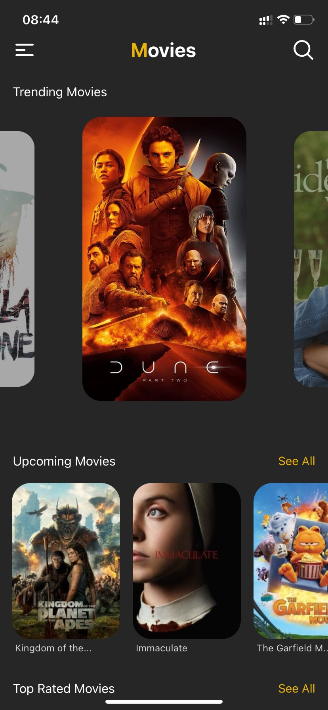
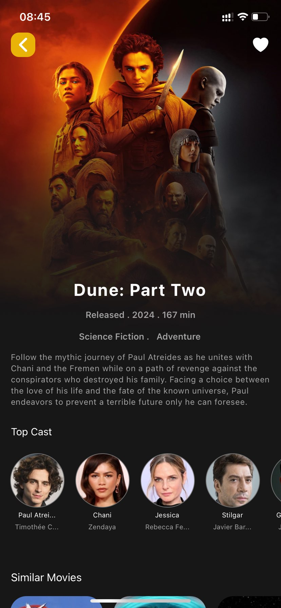
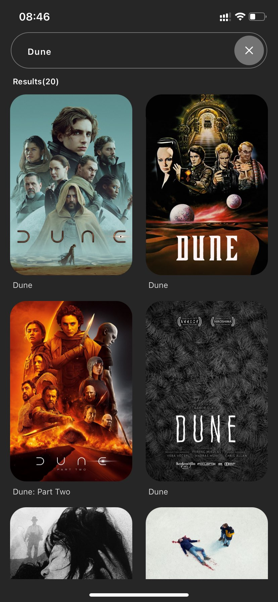

> **Movie Database App**

Welcome to the Movie Database App! This project aims to provide a comprehensive platform similar to IMDb, allowing users to explore and discover information about various movies.

Features
Browse Movies: Explore a vast collection of movies, including popular, upcoming, and top-rated films.
Search Functionality: Easily find specific movies by searching through titles, genres, or cast members.
Movie Details: View detailed information about each movie, including synopsis, cast and crew, ratings, release date, and more.
Favorites: Save your favorite movies to easily access them later.
User Authentication: Securely sign up and log in to personalize your experience and access additional features.

> **Technologies Used**

React Native: Utilized for building the cross-platform mobile application.
Expo: Simplified the development process by providing tools and services for React Native projects.
Firebase: Integrated for user authentication and data storage, ensuring a seamless and secure experience for users.
The Movie Database (TMDb) API: Leveraged to fetch movie data, including details, images, and ratings.

> **Getting Started**

To get started with the Movie Database App, follow these steps:

**Clone the Repository:** Clone this repository to your local machine using the following command:

**command:** git clone https://github.com/Cypher-O/movieapp.git

**Install Dependencies:** Navigate to the project directory and install the necessary dependencies by running:

**Command:** cd movieapp

**command:** npm install

**Configure Firebase:** Set up a Firebase project and configure it with the necessary credentials. Update the Firebase configuration in the project accordingly.
**Start the Application:** Start the Expo development server by running:

**command:** npx expo start

**Run on Device/Emulator:** Use the Expo Go app to run the application on your physical device, or launch an emulator to test it on a virtual device.

> **Contributing**

Contributions to the Movie Database App are welcome! If you encounter any issues, have suggestions for improvements, or would like to contribute new features, feel free to open an issue or submit a pull request. Please adhere to the project's coding standards and guidelines.

<table>
  <tr>
    <td></td>
    <td></td>
    <td></td>
    <td></td>
    <td></td>
  </tr>
</table>
